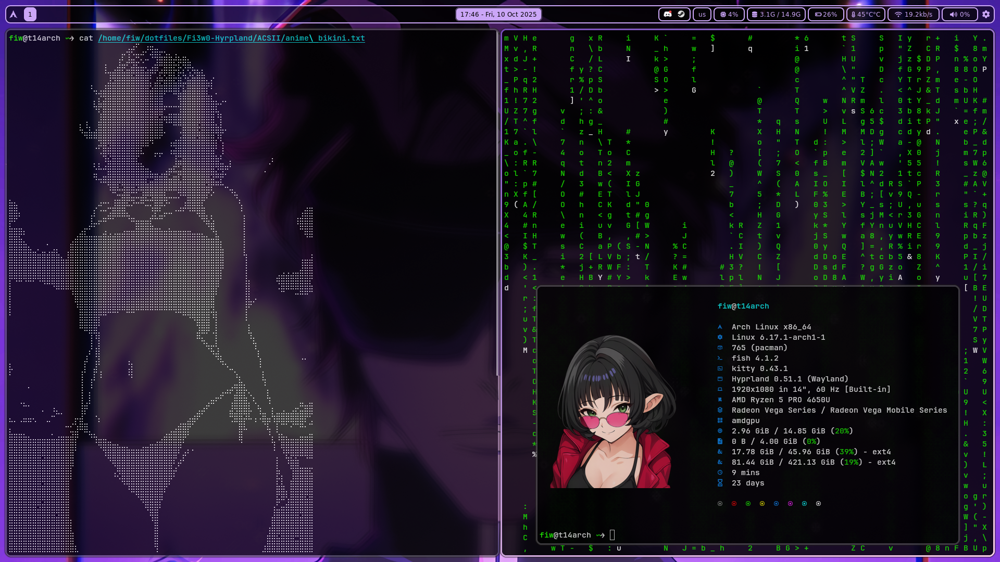

# Fi3w0-Hyprland

This is **my personal Arch Linux + Hyprland configuration**.  
The main purpose of this repository is to **backup my system**, because honestly, I’m like a monkey with an AWP in space when it comes to making thing work without errors.

⚠️ **Disclaimer:**  
You’re free to browse or experiment with these dotfiles, but I don’t recommend using them on your system directly—they’re tailored to my setup and may break yours.

---

## What’s inside?
- Hyprland configuration files
- Waybar, Rofi, Fish shell setups
- Wallpapers and assets
- Random experimental tweaks

---

## Usage
Clone the repo if you really want, but carefully:  
```bash
git clone https://github.com/fi3w0/Fi3w0-Hyprland.git

Copy files to your configuration folder (example):

cp -r Fi3w0-Hyprland/* ~/.config/
```
AND DO NOT FOLDER TO CHANGE CONFIG FILES LOCATIONS SO ALL WORKS FINE RIGHT NOW THERE IS MY LOCATIONS BUT YOU NEED TO CHANGE IT.

Here’s a quick glance at the main applications I use in this setup:

┌───────────────────────────────┐
│   🪟 Hyprland WM              │
│   📊 Waybar                   │
│   🔍 Rofi                     │
│   🐟 Fish Shell               │
│   🖥️ Kitty Terminal           │
│   🌐 Firefox                  │
│   ⚡ Fastfetch                │
│   📁 Dolphin / nnn            │
│   📦 Flatpak / Pacman         │
│   🔊 Pulseaudio               │
│   🎶 Cava                     │
│   💻 Cmatrix                  │
│   🔧 Pavucontrol              │
│   📈 Htop                     │
└───────────────────────────────┘


(How does it look)



(there is no Fastfetch config but you can look it here this is the one I use [Fastfetch cli](https://github.com/fastfetch-cli/fastfetch))


License

This repository is for personal use. You may explore or adapt it at your own risk.
