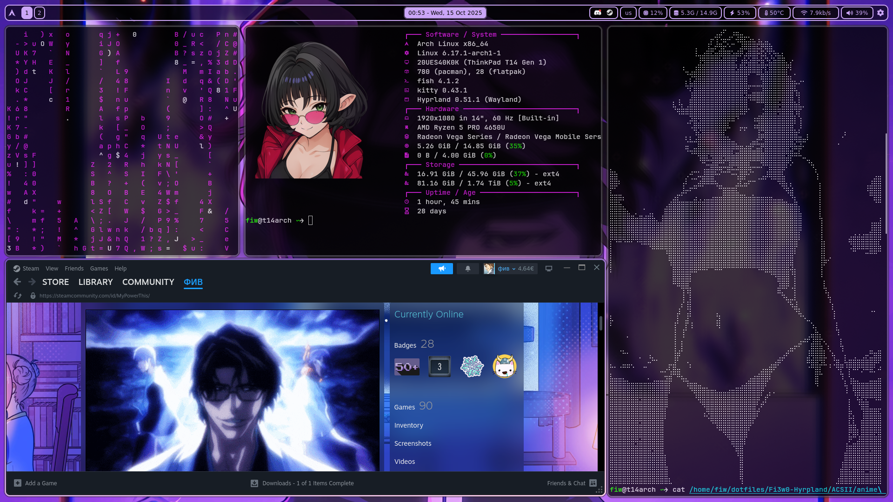
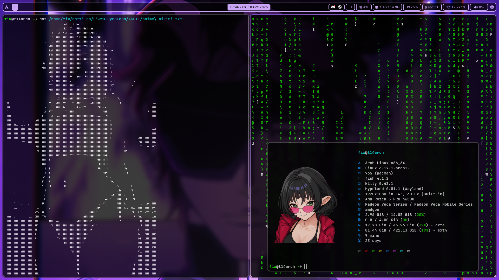
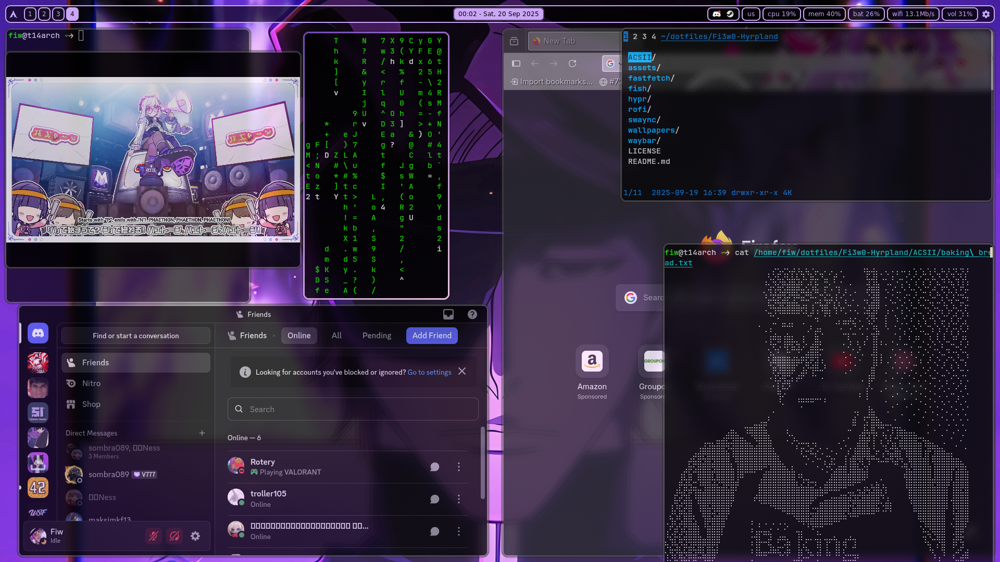
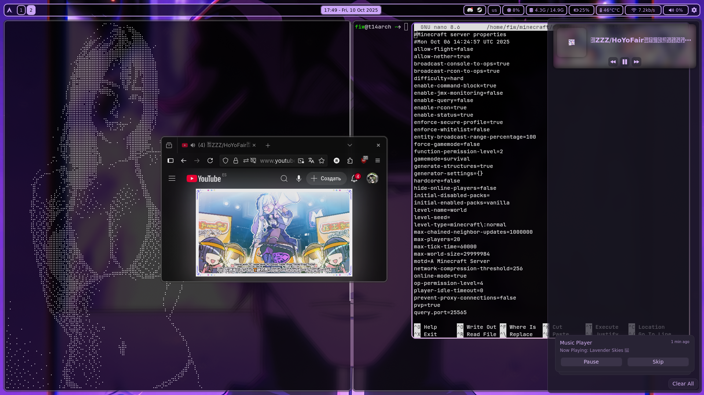

# Fi3w0-Hyprland



> Arch Linux · Hyprland · Terminal-First · Daily Driver

My personal Hyprland dotfiles — built from scratch on bare Arch Linux with zero prior Linux experience. No KDE, no GNOME, no training wheels. Configured everything from the ground up in two weeks and have been running it as my daily driver for 6+ months.

---

## System

| | |
|---|---|
| **OS** | Arch Linux x86_64 |
| **Kernel** | Linux 6.18.9-arch1-2 |
| **WM** | Hyprland 0.54.1 (Wayland) |
| **Machine** | ThinkPad T14 Gen 1 — AMD Ryzen 5 PRO 4650U |
| **Shell** | Fish 4.5.0 |
| **Terminal** | Kitty 0.45.0 |
| **Uptime** | 170 days and counting |

---

## Screenshots





---

## What's Inside

| Component | Tool |
|---|---|
| **Window Manager** | Hyprland |
| **Bar** | Waybar |
| **Launcher** | Rofi |
| **Shell** | Fish |
| **Terminal** | Kitty |
| **Editor** | Neovim |
| **Notifications** | SwayNC |
| **Wallpaper** | Hyprpaper / swww |
| **Lock Screen** | Hyprlock |
| **Audio** | PulseAudio · Cava · Pavucontrol |
| **File Manager** | Nautilus / Ranger |
| **Browser** | Firefox |
| **Image Viewer** | imv |
| **System Info** | Fastfetch |
| **Monitoring** | Htop · Gtop |
| **Packages** | Pacman (762) · Flatpak (29) |

---

## Features

- Screenshot with SwayNC notification and auto copy to clipboard
- Custom Hyprpaper wallpaper script
- Neovim and Waybar theming scripts
- Custom Fastfetch config
- Lean setup — no bloat, everything has a purpose

---

## Usage

Clone the repo and copy configs to `~/.config/`:

```bash
git clone https://github.com/fi3w0/Fi3w0-Hyprland.git
cd Fi3w0-Hyprland

cp -r hypr ~/.config/
cp -r waybar ~/.config/
cp -r rofi ~/.config/
cp -r fish ~/.config/
cp -r nvim ~/.config/
cp -r swaync ~/.config/
cp -r .icons ~/
```

For wallpapers:
```bash
cp -r wallpapers ~/Pictures/
```

<<<<<<< HEAD

Here’s a quick glance at the main applications I use in this setup:

│   🪟 Hyprland WM              │
│   📊 Waybar                   │
│   📊 Htop                     │
│   📊 Gtop                     │
│   📊 Fastfetch                │
│   🔍 Rofi                     │
│   🐟 Fish Shell               │
│   🐟 Kitty Terminal           │
│   🌐 Firefox                  │
│   📁 Nautilus / Ranger        │
│   📁 Flatpak / Pacman         │
│   🎶 Pulseaudio               │
│   🎶 Cava                     │
│   💻 Cmatrix                  │
│   🔧 Pavucontrol              │
│   🔒 Hyprlock                 │
│   🖼️ imv                      │
│   ✍️ Neovim                   │
│   📰 SwayNC                   │
│   🪟 Hyprpaper / swww         │


(How does it look)


- (There is no Fastfetch config but you can look it here this is the one I use [Fastfetch cli](https://github.com/fastfetch-cli/fastfetch))

- (SwayNC is working 50/50 so you may not use it if you don't care that much about Notification centre)

License

This repository is for personal use. You may explore or adapt it at your own risk.
=======
> **Note:** These configs are tailored to my hardware and workflow. You'll likely need to adjust monitor settings, keybindings, and paths. Read through `hypr/hyprland.conf` before applying anything.
>>>>>>> 8010a9b (Updated README.md, fixed Hyrpland main config new version, fixed wallpaper 2 wrong files, fixed fastfetch config :3)

---

## Notes

- SwayNC works but can be temperamental depending on your setup — optional if you don't need a notification center
- This repo also serves as my system backup — commit history reflects real changes to my daily environment

---

## License

MIT — explore, adapt, break things. That's how I learned too.
