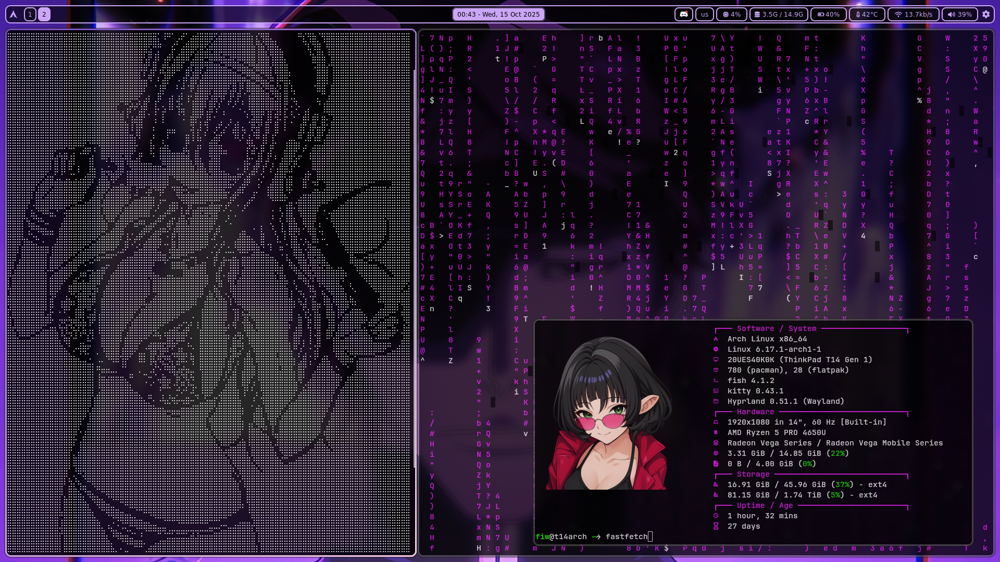
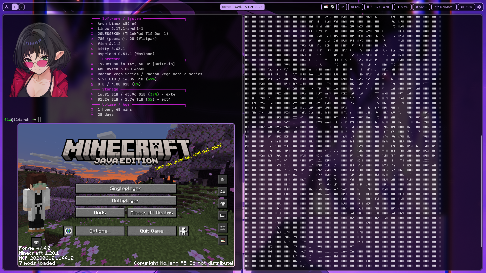
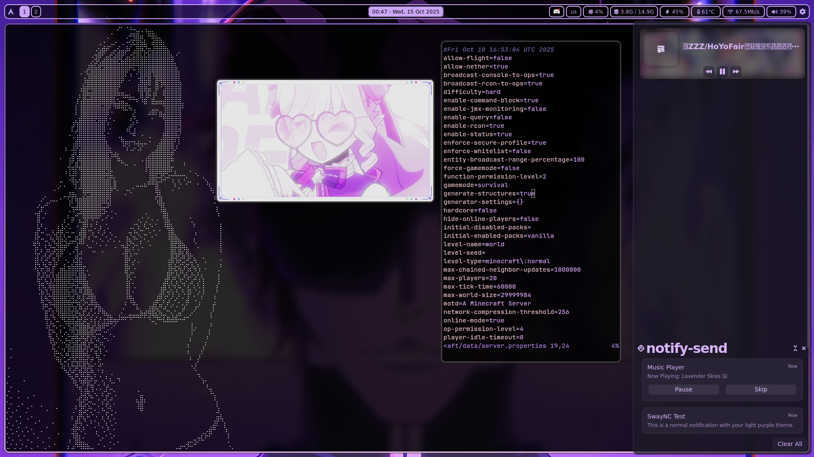

# Fi3w0-Hyprland


This is **my personal Arch Linux + Hyprland configuration**.  
The main purpose of this repository is to **backup my system**, because honestly, I’m still learning to use Linux.

⚠️ **Disclaimer:**  
You’re free to browse or experiment with these dotfiles, but I don’t recommend using them on your system directly—they’re tailored to my setup and may break yours.

---

## What’s inside?
- Hyprland configuration files
- Waybar, Rofi, Fish shell setups
- Wallpapers and assets
- Random experimental tweaks
- Some themes scripts for Nvim or Waybar

---

## Usage

Clone this repository:

```bash
git clone https://github.com/fi3w0/Fi3w0-Hyprland.git

Then copy the configuration files to your user config directory (~/.config/) so they are picked up by your system:

cp -r Fi3w0-Hyprland/hyprland ~/.config/
cp -r Fi3w0-Hyprland/waybar ~/.config/
cp -r Fi3w0-Hyprland/rofi ~/.config/
cp -r Fi3w0-Hyprland/fish ~/.config/
cp -r Fi3w0-Hyprland/nvim ~/.config/
cp -r Fi3w0-Hyprland/Wallpapers ~/home/
cp -r Fi3w0-Hyprland/.icons ~/home/

For assets, copy them to your Pictures or config folder (or just delete):

mkdir -p ~/Pictures
cp -r Fi3w0-Hyprland/assets ~/.config/

    ⚠️ Important: These configuration files are specifically tailored for my system and setup.
    You may need to adjust paths, keybindings, or other settings to make them work properly on your own system.
```


Here’s a quick glance at the main applications I use in this setup:

│   🪟 Hyprland WM              │
│   📊 Waybar                   │
│   📊 Htop                     │
│   📊 Gtop                     │
│   📊 Fastfetch                │
│   🔍 Rofi                     │
│   🐟 Fish Shell               │
│   🐟 Kitty Terminal           │
│   🌐 Firefox                  │
│   📁 Nautilus                 │
│   📁 Flatpak / Pacman         │
│   🎶 Pulseaudio               │
│   🎶 Cava                     │
│   💻 Cmatrix                  │
│   🔧 Pavucontrol              │
│   🔒 Hyprlock                 │
│   🖼️ imv                      │
│   ✍️ Neovim                   │
│   📰 SwayNC                   │


(How does it look)





- (There is no Fastfetch config but you can look it here this is the one I use [Fastfetch cli](https://github.com/fastfetch-cli/fastfetch))

- (SwayNC is working 50/50 so you may not use it if you don't care that much about Notification centre)

License

This repository is for personal use. You may explore or adapt it at your own risk.

---
